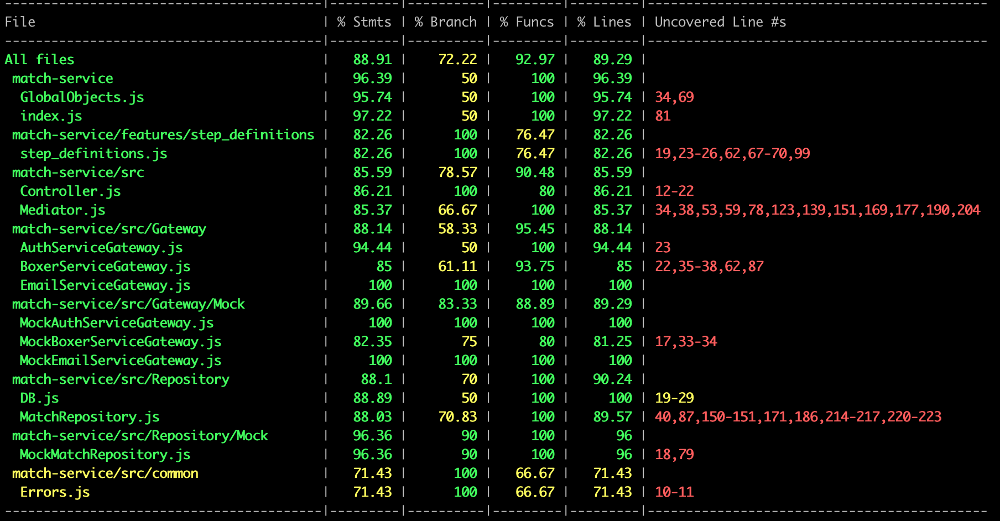

# Docs

## Coverage

### Coverage before refactoring

| File                                      | % Stmts   | % Branch   | % Funcs   | % Lines   | Uncovered Line #s                            |
| ----------------------------------------- | --------- | ---------- | --------- | --------- | -------------------------------------------- |
| All files                                 | 88.91     | 72.22      | 92.97     | 89.29     |                                              |
| match-service                             | 96.39     | 50         | 100       | 96.39     |                                              |
| GlobalObjects.js                          | 95.74     | 50         | 100       | 95.74     | 34,69                                        |
| index.js                                  | 97.22     | 50         | 100       | 97.22     | 81                                           |
| match-service/features/step_definitions   | 82.26     | 100        | 76.47     | 82.26     |                                              |
| step_definitions.js                       | 82.26     | 100        | 76.47     | 82.26     | 19,23-26,62,67-70,99                         |
| match-service/src                         | 85.59     | 78.57      | 90.48     | 85.59     |                                              |
| Controller.js                             | 86.21     | 100        | 80        | 86.21     | 12-22                                        |
| Mediator.js                               | 85.37     | 66.67      | 100       | 85.37     | 34,38,53,59,78,123,139,151,169,177,190,204   |
| match-service/src/Gateway                 | 88.14     | 58.33      | 95.45     | 88.14     |                                              |
| AuthServiceGateway.js                     | 94.44     | 50         | 100       | 94.44     | 23                                           |
| BoxerServiceGateway.js                    | 85        | 61.11      | 93.75     | 85        | 22,35-38,62,87                               |
| EmailServiceGateway.js                    | 100       | 100        | 100       | 100       |                                              |
| match-service/src/Gateway/Mock            | 89.66     | 83.33      | 88.89     | 89.29     |                                              |
| MockAuthServiceGateway.js                 | 100       | 100        | 100       | 100       |                                              |
| MockBoxerServiceGateway.js                | 82.35     | 75         | 80        | 81.25     | 17,33-34                                     |
| MockEmailServiceGateway.js                | 100       | 100        | 100       | 100       |                                              |
| match-service/src/Repository              | 88.1      | 70         | 100       | 90.24     |                                              |
| DB.js                                     | 88.89     | 50         | 100       | 100       | 19-29                                        |
| MatchRepository.js                        | 88.03     | 70.83      | 100       | 89.57     | 40,87,150-151,171,186,214-217,220-223        |
| match-service/src/Repository/Mock         | 96.36     | 90         | 100       | 96        |                                              |
| MockMatchRepository.js                    | 96.36     | 90         | 100       | 96        | 18,79                                        |
| match-service/src/common                  | 71.43     | 100        | 66.67     | 71.43     |                                              |
| Errors.js                                 | 71.43     | 100        | 66.67     | 71.43     | 10-11                                        |
